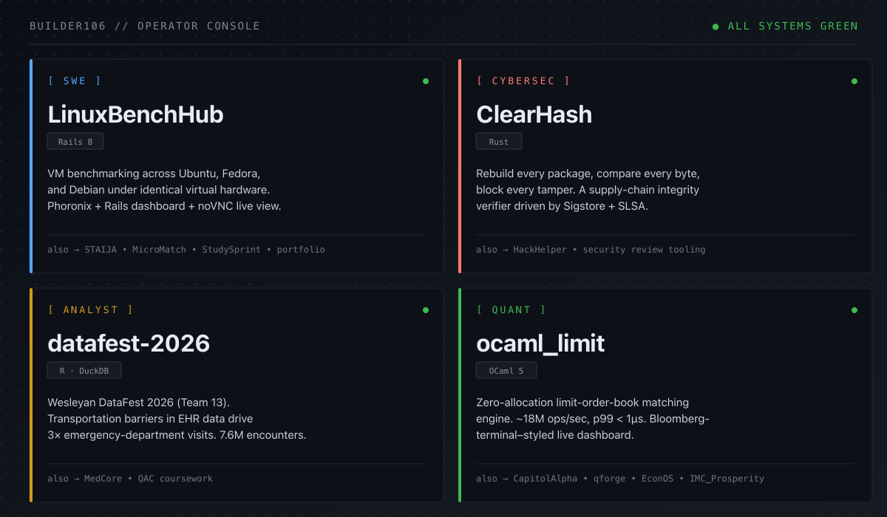

<picture>
  <source media="(prefers-color-scheme: dark)"  srcset="assets/banner-dark.png">
  <source media="(prefers-color-scheme: light)" srcset="assets/banner-light.png">
  
</picture>

CS student at Wesleyan. I build across four tracks. Console below is the manifest — every flagship is a live repo, every claim is in its README.

<picture>
  <source media="(prefers-color-scheme: dark)"  srcset="assets/console-dark.png">
  <source media="(prefers-color-scheme: light)" srcset="assets/console-light.png">
  
</picture>

## SWE

- **[LinuxBenchHub](https://github.com/Builder106/LinuxBenchHub)** · `Rails 8` — VM benchmarking across Ubuntu, Fedora, and Debian under identical virtual hardware. Phoronix + Rails dashboard + noVNC live view. ([demo](https://linuxbenchhub.vercel.app/))
- **[STAIJA](https://github.com/Builder106/STAIJA)** · `Next.js` — STEM mentorship + applications + LMS for STAIJA's StepUp Scholars and Dynamerge programs. ([live](https://staija.org))
- **[StudySprint](https://github.com/Builder106/StudySprint)** · `React · Express` — Study session tracker with focus timer, streaks, AI syllabus parser, and co-study rooms. ([demo](https://getstudysprint.vercel.app))
- **[MicroMatch](https://github.com/Builder106/MicroMatch)** · `SvelteKit · Appwrite` — Micro-volunteering marketplace pairing NGOs with volunteers for skill-building tasks. ([demo](https://trymicromatch.vercel.app))
- **[builder106.github.io](https://github.com/Builder106/builder106.github.io)** · `React Three Fiber` — Interactive 3D portfolio. ([live](https://yinkavaughan.me/))

## Cybersec

- **[ClearHash](https://github.com/Builder106/ClearHash)** · `Rust` — Rebuild every package, compare every byte, block every tamper. A supply-chain integrity verifier driven by Sigstore + SLSA. ([demo](https://clearhash.vercel.app/))
- **[HackHelper](https://github.com/Builder106/HackHelper)** · `Python` — Tooling for security-flavored hackathon workflows.

## Analyst

- **[datafest-2026](https://github.com/Builder106/datafest-2026)** · `R · DuckDB` — Wesleyan DataFest 2026 (Team 13). Transportation barriers in Stormont Vail EHR data drive 3× higher emergency-department use. 7.6M encounters, 947K patients. ([demo](https://datafest-2026.vercel.app/))
- **[MedCore](https://github.com/Builder106/MedCore)** · `TypeScript` — African health site exploring continental medical data.

## Quant

- **[ocaml_limit](https://github.com/Builder106/ocaml_limit)** · `OCaml 5` — Zero-allocation limit-order-book matching engine. ~18M ops/sec, p99 < 1µs. Bloomberg-terminal–styled live dashboard. ([demo](https://ocaml-lob.vercel.app/))
- **[CapitolAlpha](https://github.com/Builder106/CapitolAlpha)** · `Python · Jupyter` — Found a **+2.58% Jensen's α** (p<0.05) across 16,203 disclosed Congressional trades, 2020–2024. ([demo](https://capitolalpha.vercel.app/))
- **[qforge](https://github.com/Builder106/qforge)** · `C99` — Zero-dependency neural network engine + DQN trading agent + synthetic market data generator. ([demo](https://qforge-neural.vercel.app/))
- **[EconOS](https://github.com/Builder106/EconOS)** · `Python · PettingZoo · SB3` — MARL macroeconomic sandbox with a desktop-style telemetry UI for live policy intervention. ([demo](https://econ-os.vercel.app/))
- **[IMC_Prosperity](https://github.com/Builder106/IMC_Prosperity)** · `Python` — Trading assistant from the IMC Prosperity competition.

## Stack

**Systems** &nbsp; OCaml · Rust · C · Swift &nbsp;·&nbsp; **Web** &nbsp; TypeScript · React · Next.js · SvelteKit · Rails · Express · Tailwind
**Data** &nbsp; Python · R · Jupyter · DuckDB · pandas · PettingZoo · Stable-Baselines3 &nbsp;·&nbsp; **Infra** &nbsp; Docker · GitHub Actions · Vercel · Caddy · Oracle Cloud · Playwright

## Elsewhere

- Portfolio · [yinkavaughan.me](https://yinkavaughan.me/) ([source](https://github.com/Builder106/builder106.github.io))
- LinkedIn · [in/yinka-vaughan](https://www.linkedin.com/in/yinka-vaughan)
- Devpost · [olayinkav](https://devpost.com/olayinkav)
- Email · [vaughanolayinka@gmail.com](mailto:vaughanolayinka@gmail.com)
