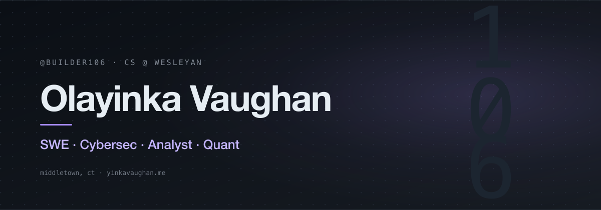

<picture>
  <source media="(prefers-color-scheme: dark)"  srcset="assets/banner-dark.png">
  <source media="(prefers-color-scheme: light)" srcset="assets/banner-light.png">
  
</picture>

CS student at Wesleyan. The table below is my work, arranged by the language that wrote it and the discipline that motivated it. Every cell links to a live repo.

## Periodic Table of Self

<table>
<tr>
  <td></td>
  <td></td><td></td><td></td><td></td><td></td><td></td>
  <td></td>
</tr>
<tr>
  <td></td>
  <td></td>
  <td></td><td></td><td></td><td></td>
  <td></td>
  <td></td>
</tr>
<tr>
  <td></td>
  <td></td>
  <td></td>
  <td></td>
  <td></td>
  <td></td>
  <td></td>
  <td></td>
</tr>
<tr>
  <td></td>
  <td></td>
  <td></td>
  <td></td>
  <td></td>
  <td></td><td></td><td></td>
</tr>
</table>

**Groups** &nbsp;  &nbsp;  &nbsp;  &nbsp;  &nbsp;  &nbsp; 

**Symbols** &nbsp; `Oc` OCaml &nbsp; `Rs` Rust &nbsp; `C` C99 &nbsp; `Py` Python &nbsp; `R` R &nbsp; `Rb` Ruby &nbsp; `Ts` TypeScript &nbsp; `Js` JavaScript &nbsp; `Sv` Svelte &nbsp; `Sw` Swift &nbsp; `Kt` Kotlin &nbsp; `Sh` Shell

## Flagships

- **[ocaml_limit](https://github.com/Builder106/ocaml_limit)** &nbsp;·&nbsp; Zero-allocation limit-order-book matching engine. ~18M ops/sec, p99 < 1µs. Bloomberg-terminal–styled live dashboard. → [demo](https://ocaml-lob.vercel.app/)
- **[ClearHash](https://github.com/Builder106/ClearHash)** &nbsp;·&nbsp; Rebuild every package, compare every byte, block every tamper. A supply-chain integrity verifier driven by Sigstore + SLSA. → [demo](https://clearhash.vercel.app/)
- **[CapitolAlpha](https://github.com/Builder106/CapitolAlpha)** &nbsp;·&nbsp; Found a **+2.58% Jensen's α** (p<0.05) across 16,203 disclosed Congressional trades, 2020–2024. → [demo](https://capitolalpha.vercel.app/)
- **[datafest-2026](https://github.com/Builder106/datafest-2026)** &nbsp;·&nbsp; Wesleyan DataFest 2026 (Team 13). Transportation barriers in EHR data drive 3× emergency-department visits. 7.6M encounters. → [demo](https://datafest-2026.vercel.app/)
- **[LinuxBenchHub](https://github.com/Builder106/LinuxBenchHub)** &nbsp;·&nbsp; VM benchmarking across Ubuntu, Fedora, Debian under identical virtual hardware. Phoronix + Rails 8 + noVNC live view. → [demo](https://linuxbenchhub.vercel.app/)

## Stack

**Systems** &nbsp; OCaml · Rust · C · Swift &nbsp;·&nbsp; **Web** &nbsp; TypeScript · React · Next.js · SvelteKit · Rails · Express · Tailwind
**Data** &nbsp; Python · R · Jupyter · DuckDB · pandas · PettingZoo · Stable-Baselines3 &nbsp;·&nbsp; **Infra** &nbsp; Docker · GitHub Actions · Vercel · Caddy · Oracle Cloud · Playwright

## Elsewhere

- Portfolio · [yinkavaughan.me](https://yinkavaughan.me/) ([source](https://github.com/Builder106/builder106.github.io))
- LinkedIn · [in/yinka-vaughan](https://www.linkedin.com/in/yinka-vaughan)
- Devpost · [olayinkav](https://devpost.com/olayinkav)
- Email · [vaughanolayinka@gmail.com](mailto:vaughanolayinka@gmail.com)
