<picture>
  <source media="(prefers-color-scheme: dark)"  srcset="assets/hero-dark.svg">
  <source media="(prefers-color-scheme: light)" srcset="assets/hero-light.svg">
  
</picture>

CS student at Wesleyan. 19 projects across 12 languages and 4 disciplines. Every cell in the table below is a clickable link to a live repo.

## The Elements

<table cellspacing="2" cellpadding="0" border="0">
  <tr>
    <td width="28"></td>
    <td width="132" align="center"><code>1</code></td>
    <td width="132" align="center"><code>2</code></td>
    <td width="132" align="center"><code>3</code></td>
    <td width="132" align="center"><code>4</code></td>
    <td width="132" align="center"><code>5</code></td>
    <td width="132" align="center"><code>6</code></td>
    <td width="132" align="center"><code>7</code></td>
    <td width="132" align="center"><code>8</code></td>
  </tr>
  <tr>
    <td width="28" align="right" valign="middle"><code>1</code></td>
    <td width="132" align="center"><a href="https://github.com/Builder106/ocaml_limit" title="ocaml_limit"><picture><source media="(prefers-color-scheme: dark)" srcset="assets/cells/01-oc-dark.svg"><source media="(prefers-color-scheme: light)" srcset="assets/cells/01-oc-light.svg"></picture></a></td>
    <td width="132"></td>
    <td width="132"></td>
    <td width="132"></td>
    <td width="132"></td>
    <td width="132"></td>
    <td width="132"></td>
    <td width="132" align="center"><a href="https://github.com/Builder106/qforge" title="qforge"><picture><source media="(prefers-color-scheme: dark)" srcset="assets/cells/02-c-dark.svg"><source media="(prefers-color-scheme: light)" srcset="assets/cells/02-c-light.svg"></picture></a></td>
  </tr>
  <tr>
    <td width="28" align="right" valign="middle"><code>2</code></td>
    <td width="132" align="center"><a href="https://github.com/Builder106/ClearHash" title="ClearHash"><picture><source media="(prefers-color-scheme: dark)" srcset="assets/cells/03-rs-dark.svg"><source media="(prefers-color-scheme: light)" srcset="assets/cells/03-rs-light.svg"></picture></a></td>
    <td width="132" align="center"><a href="https://github.com/Builder106/CapitolAlpha" title="CapitolAlpha"><picture><source media="(prefers-color-scheme: dark)" srcset="assets/cells/04-py-dark.svg"><source media="(prefers-color-scheme: light)" srcset="assets/cells/04-py-light.svg"></picture></a></td>
    <td width="132"></td>
    <td width="132"></td>
    <td width="132"></td>
    <td width="132"></td>
    <td width="132" align="center"><a href="https://github.com/Builder106/datafest-2026" title="datafest-2026"><picture><source media="(prefers-color-scheme: dark)" srcset="assets/cells/05-r-dark.svg"><source media="(prefers-color-scheme: light)" srcset="assets/cells/05-r-light.svg"></picture></a></td>
    <td width="132" align="center"><a href="https://github.com/Builder106/EconOS" title="EconOS"><picture><source media="(prefers-color-scheme: dark)" srcset="assets/cells/06-js-dark.svg"><source media="(prefers-color-scheme: light)" srcset="assets/cells/06-js-light.svg"></picture></a></td>
  </tr>
  <tr>
    <td width="28" align="right" valign="middle"><code>3</code></td>
    <td width="132" align="center"><a href="https://github.com/Builder106/LinuxBenchHub" title="LinuxBenchHub"><picture><source media="(prefers-color-scheme: dark)" srcset="assets/cells/07-rb-dark.svg"><source media="(prefers-color-scheme: light)" srcset="assets/cells/07-rb-light.svg"></picture></a></td>
    <td width="132" align="center"><a href="https://github.com/Builder106/STAIJA" title="STAIJA"><picture><source media="(prefers-color-scheme: dark)" srcset="assets/cells/08-ts-dark.svg"><source media="(prefers-color-scheme: light)" srcset="assets/cells/08-ts-light.svg"></picture></a></td>
    <td width="132" align="center"><a href="https://github.com/Builder106/StudySprint" title="StudySprint"><picture><source media="(prefers-color-scheme: dark)" srcset="assets/cells/09-ts-dark.svg"><source media="(prefers-color-scheme: light)" srcset="assets/cells/09-ts-light.svg"></picture></a></td>
    <td width="132" align="center"><a href="https://github.com/Builder106/MicroMatch" title="MicroMatch"><picture><source media="(prefers-color-scheme: dark)" srcset="assets/cells/10-sv-dark.svg"><source media="(prefers-color-scheme: light)" srcset="assets/cells/10-sv-light.svg"></picture></a></td>
    <td width="132" align="center"><a href="https://github.com/Builder106/MedCore" title="MedCore"><picture><source media="(prefers-color-scheme: dark)" srcset="assets/cells/11-ts-dark.svg"><source media="(prefers-color-scheme: light)" srcset="assets/cells/11-ts-light.svg"></picture></a></td>
    <td width="132" align="center"><a href="https://github.com/Builder106/builder106.github.io" title="portfolio"><picture><source media="(prefers-color-scheme: dark)" srcset="assets/cells/12-ts-dark.svg"><source media="(prefers-color-scheme: light)" srcset="assets/cells/12-ts-light.svg">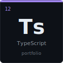</picture></a></td>
    <td width="132" align="center"><a href="https://github.com/Builder106/IMC_Prosperity" title="IMC_Prosperity"><picture><source media="(prefers-color-scheme: dark)" srcset="assets/cells/13-py-dark.svg"><source media="(prefers-color-scheme: light)" srcset="assets/cells/13-py-light.svg"></picture></a></td>
    <td width="132" align="center"><a href="https://github.com/Builder106/HackHelper" title="HackHelper"><picture><source media="(prefers-color-scheme: dark)" srcset="assets/cells/14-py-dark.svg"><source media="(prefers-color-scheme: light)" srcset="assets/cells/14-py-light.svg"></picture></a></td>
  </tr>
  <tr>
    <td width="28" align="right" valign="middle"><code>4</code></td>
    <td width="132" align="center"><a href="https://github.com/Builder106/donut" title="donut"><picture><source media="(prefers-color-scheme: dark)" srcset="assets/cells/15-sw-dark.svg"><source media="(prefers-color-scheme: light)" srcset="assets/cells/15-sw-light.svg"></picture></a></td>
    <td width="132" align="center"><a href="https://github.com/Builder106/DOOM" title="DOOM"><picture><source media="(prefers-color-scheme: dark)" srcset="assets/cells/16-sw-dark.svg"><source media="(prefers-color-scheme: light)" srcset="assets/cells/16-sw-light.svg"></picture></a></td>
    <td width="132" align="center"><a href="https://github.com/Builder106/MetaHelper" title="MetaHelper"><picture><source media="(prefers-color-scheme: dark)" srcset="assets/cells/17-kt-dark.svg"><source media="(prefers-color-scheme: light)" srcset="assets/cells/17-kt-light.svg"></picture></a></td>
    <td width="132" align="center"><a href="https://github.com/Builder106/PocketStyle" title="PocketStyle"><picture><source media="(prefers-color-scheme: dark)" srcset="assets/cells/18-sh-dark.svg"><source media="(prefers-color-scheme: light)" srcset="assets/cells/18-sh-light.svg"></picture></a></td>
    <td width="132" align="center"><a href="https://github.com/Builder106/terminal" title="terminal"><picture><source media="(prefers-color-scheme: dark)" srcset="assets/cells/19-py-dark.svg"><source media="(prefers-color-scheme: light)" srcset="assets/cells/19-py-light.svg">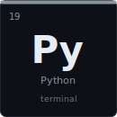</picture></a></td>
    <td width="132"></td>
    <td width="132"></td>
    <td width="132"></td>
  </tr>
</table>

**Groups** &nbsp;  &nbsp;  &nbsp;  &nbsp;  &nbsp;  &nbsp; 

**Symbols** &nbsp; `Oc` OCaml &nbsp; `Rs` Rust &nbsp; `C` C99 &nbsp; `Py` Python &nbsp; `R` R &nbsp; `Rb` Ruby &nbsp; `Ts` TypeScript &nbsp; `Js` JavaScript &nbsp; `Sv` Svelte &nbsp; `Sw` Swift &nbsp; `Kt` Kotlin &nbsp; `Sh` Shell

## Flagships

- **[ocaml_limit](https://github.com/Builder106/ocaml_limit)** &nbsp;·&nbsp; Zero-allocation limit-order-book matching engine in OCaml 5. ~18M ops/sec, p99 < 1µs. Bloomberg-terminal–styled live dashboard. → [demo](https://ocaml-lob.vercel.app/)
- **[ClearHash](https://github.com/Builder106/ClearHash)** &nbsp;·&nbsp; Rebuild every package, compare every byte, block every tamper. A Rust supply-chain integrity verifier driven by Sigstore + SLSA. → [demo](https://clearhash.vercel.app/)
- **[CapitolAlpha](https://github.com/Builder106/CapitolAlpha)** &nbsp;·&nbsp; Found a **+2.58% Jensen's α** (p<0.05) across 16,203 disclosed Congressional trades, 2020–2024. → [demo](https://capitolalpha.vercel.app/)
- **[datafest-2026](https://github.com/Builder106/datafest-2026)** &nbsp;·&nbsp; Wesleyan DataFest 2026 (Team 13). Transportation barriers in EHR data drive 3× emergency-department visits. 7.6M encounters, 947K patients. → [demo](https://datafest-2026.vercel.app/)
- **[LinuxBenchHub](https://github.com/Builder106/LinuxBenchHub)** &nbsp;·&nbsp; VM benchmarking across Ubuntu, Fedora, and Debian under identical virtual hardware. Phoronix + Rails 8 + noVNC live view. → [demo](https://linuxbenchhub.vercel.app/)

## Stack

**Systems** &nbsp; OCaml · Rust · C · Swift &nbsp;·&nbsp; **Web** &nbsp; TypeScript · React · Next.js · SvelteKit · Rails · Express · Tailwind
**Data** &nbsp; Python · R · Jupyter · DuckDB · pandas · PettingZoo · Stable-Baselines3 &nbsp;·&nbsp; **Infra** &nbsp; Docker · GitHub Actions · Vercel · Caddy · Oracle Cloud · Playwright

## Elsewhere

- Portfolio · [yinkavaughan.me](https://yinkavaughan.me/) ([source](https://github.com/Builder106/builder106.github.io))
- LinkedIn · [in/yinka-vaughan](https://www.linkedin.com/in/yinka-vaughan)
- Devpost · [olayinkav](https://devpost.com/olayinkav)
- Email · [vaughanolayinka@gmail.com](mailto:vaughanolayinka@gmail.com)
