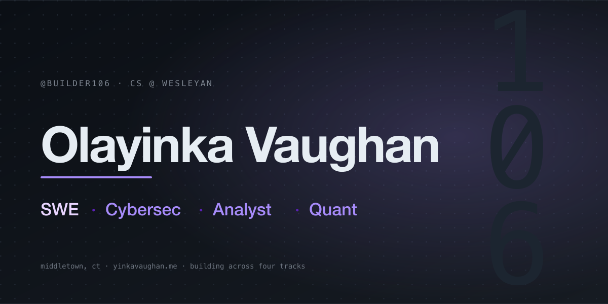
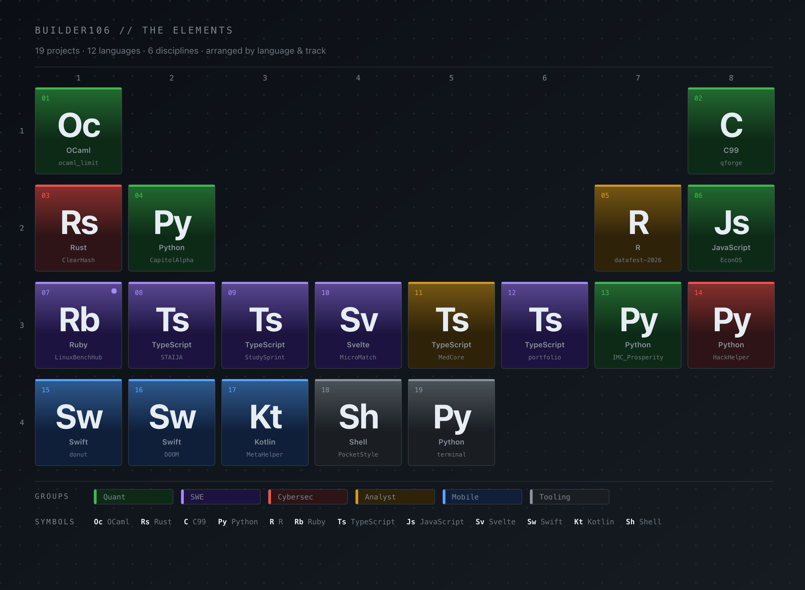

<picture>
  <source media="(prefers-color-scheme: dark)"  srcset="assets/hero-dark.svg">
  <source media="(prefers-color-scheme: light)" srcset="assets/hero-light.svg">
  
</picture>

CS student at Wesleyan. 19 projects across 12 languages and 4 disciplines, laid out below by language and track.

## The Elements

<a href="https://github.com/Builder106?tab=repositories">
  <picture>
    <source media="(prefers-color-scheme: dark)"  srcset="assets/table-dark.svg">
    <source media="(prefers-color-scheme: light)" srcset="assets/table-light.svg">
    
  </picture>
</a>

## Repos

**Quant** &nbsp; [ocaml_limit](https://github.com/Builder106/ocaml_limit) · [qforge](https://github.com/Builder106/qforge) · [CapitolAlpha](https://github.com/Builder106/CapitolAlpha) · [EconOS](https://github.com/Builder106/EconOS) · [IMC_Prosperity](https://github.com/Builder106/IMC_Prosperity)
**Cybersec** &nbsp; [ClearHash](https://github.com/Builder106/ClearHash) · [HackHelper](https://github.com/Builder106/HackHelper)
**Analyst** &nbsp; [datafest-2026](https://github.com/Builder106/datafest-2026) · [MedCore](https://github.com/Builder106/MedCore)
**SWE** &nbsp; [LinuxBenchHub](https://github.com/Builder106/LinuxBenchHub) · [STAIJA](https://github.com/Builder106/STAIJA) · [StudySprint](https://github.com/Builder106/StudySprint) · [MicroMatch](https://github.com/Builder106/MicroMatch) · [portfolio](https://github.com/Builder106/builder106.github.io)
**Mobile** &nbsp; [donut](https://github.com/Builder106/donut) · [DOOM](https://github.com/Builder106/DOOM) · [MetaHelper](https://github.com/Builder106/MetaHelper)
**Tooling** &nbsp; [PocketStyle](https://github.com/Builder106/PocketStyle) · [terminal](https://github.com/Builder106/terminal)

## Flagships

- **[ocaml_limit](https://github.com/Builder106/ocaml_limit)** &nbsp;·&nbsp; Zero-allocation limit-order-book matching engine in OCaml 5. ~18M ops/sec, p99 < 1µs. Bloomberg-terminal–styled live dashboard. → [demo](https://ocaml-lob.vercel.app/)
- **[ClearHash](https://github.com/Builder106/ClearHash)** &nbsp;·&nbsp; Rebuild every package, compare every byte, block every tamper. A Rust supply-chain integrity verifier driven by Sigstore + SLSA. → [demo](https://clearhash.vercel.app/)
- **[CapitolAlpha](https://github.com/Builder106/CapitolAlpha)** &nbsp;·&nbsp; Found a **+2.58% Jensen's α** (p<0.05) across 16,203 disclosed Congressional trades, 2020–2024. → [demo](https://capitolalpha.vercel.app/)
- **[datafest-2026](https://github.com/Builder106/datafest-2026)** &nbsp;·&nbsp; Wesleyan DataFest 2026 (Team 13). Transportation barriers in EHR data drive 3× emergency-department visits. 7.6M encounters, 947K patients. → [demo](https://datafest-2026.vercel.app/)
- **[LinuxBenchHub](https://github.com/Builder106/LinuxBenchHub)** &nbsp;·&nbsp; VM benchmarking across Ubuntu, Fedora, and Debian under identical virtual hardware. Phoronix + Rails 8 + noVNC live view. → [demo](https://linuxbenchhub.vercel.app/)

## Stack

**Systems** &nbsp; OCaml · Rust · C · Swift &nbsp;·&nbsp; **Web** &nbsp; TypeScript · React · Next.js · SvelteKit · Rails · Express · Tailwind
**Data** &nbsp; Python · R · Jupyter · DuckDB · pandas · PettingZoo · Stable-Baselines3 &nbsp;·&nbsp; **Infra** &nbsp; Docker · GitHub Actions · Vercel · Caddy · Oracle Cloud · Playwright

## Elsewhere

- Portfolio · [yinkavaughan.me](https://yinkavaughan.me/) ([source](https://github.com/Builder106/builder106.github.io))
- LinkedIn · [in/yinka-vaughan](https://www.linkedin.com/in/yinka-vaughan)
- Devpost · [olayinkav](https://devpost.com/olayinkav)
- Email · [vaughanolayinka@gmail.com](mailto:vaughanolayinka@gmail.com)
