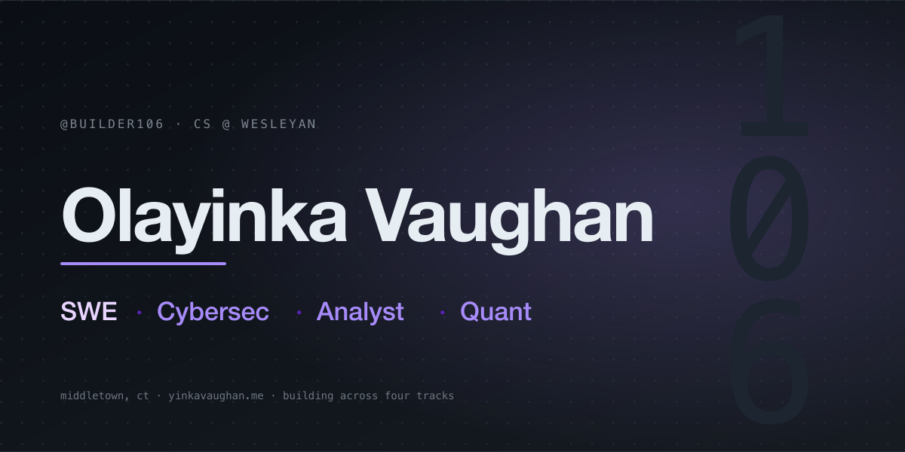

<picture>
  <source media="(prefers-color-scheme: dark)"  srcset="assets/hero-dark.svg">
  <source media="(prefers-color-scheme: light)" srcset="assets/hero-light.svg">
  
</picture>

Hi, I'm Olayinka — CS and Econ at Wesleyan. Everything I've built so far is below, arranged by language and discipline.

## Competitive Programming

<a href="https://codeforces.com/profile/Builder106">
  <picture>
    <source media="(prefers-color-scheme: dark)"  srcset="https://codeforces-readme-stats.vercel.app/api/card?username=Builder106&theme=dark">
    <source media="(prefers-color-scheme: light)" srcset="https://codeforces-readme-stats.vercel.app/api/card?username=Builder106">
    
  </picture>
</a>

## The Elements

<a href="https://github.com/Builder106?tab=repositories">
  <picture>
    <source media="(prefers-color-scheme: dark)"  srcset="assets/table-dark.svg?v=3">
    <source media="(prefers-color-scheme: light)" srcset="assets/table-light.svg?v=3">
    
  </picture>
</a>

## Repos

 &nbsp; [ocaml_limit](https://github.com/Builder106/ocaml-limit) · [qforge](https://github.com/Builder106/qforge) · [CapitolAlpha](https://github.com/Builder106/capitol-alpha) · [EconOS](https://github.com/Builder106/econ-os)

 &nbsp; [IMC_Prosperity](https://github.com/Builder106/imc-prosperity) · [enclave](https://github.com/Builder106/enclave) · [helm](https://github.com/Builder106/helm)

 &nbsp; [ClearHash](https://github.com/Builder106/clear-hash) · [halberd](https://github.com/Builder106/halberd) · [quarry](https://github.com/Builder106/quarry) · [HackHelper](https://github.com/Builder106/hack-helper)

 &nbsp; [datafest-2026](https://github.com/Builder106/datafest-2026) · [MedCore](https://github.com/Builder106/med-core)

 &nbsp; [LinuxBenchHub](https://github.com/Builder106/linux-bench-hub) · [STAIJA](https://github.com/Builder106/staija) · [StudySprint](https://github.com/Builder106/study-sprint) · [MicroMatch](https://github.com/Builder106/micro-match) · [portfolio](https://github.com/Builder106/builder106.github.io)

 &nbsp; [MetaHelper](https://github.com/Builder106/meta-helper)

 &nbsp; [ascii-arcade](https://github.com/Builder106/ascii-arcade)

## Flagships

- **[ocaml_limit](https://github.com/Builder106/ocaml-limit)** ·  — Zero-allocation limit-order-book matching engine. **~18M ops/sec, p99 < 1µs**. Bloomberg-terminal–styled live dashboard. → [demo](https://ocaml-lob.vercel.app/)
- **[ClearHash](https://github.com/Builder106/clear-hash)** ·  — Rebuild every package, compare every byte, block every tamper. Supply-chain integrity verifier driven by **Sigstore + SLSA**. → [demo](https://clearhash.vercel.app/)
- **[CapitolAlpha](https://github.com/Builder106/capitol-alpha)** ·  — Found a **+2.58% Jensen's α** (p<0.05) across 16,203 disclosed Congressional trades, 2020–2024. → [demo](https://capitolalpha.vercel.app/)
- **[datafest-2026](https://github.com/Builder106/datafest-2026)** ·  — Wesleyan DataFest 2026 (Team 13). Transportation barriers in EHR data drive **3× emergency-department visits** across 7.6M encounters, 947K patients. → [demo](https://datafest-2026.vercel.app/)
- **[LinuxBenchHub](https://github.com/Builder106/linux-bench-hub)** ·  — VM benchmarking across Ubuntu, Fedora, and Debian under **identical virtual hardware**. Phoronix + Rails 8 + noVNC live view. → [demo](https://linuxbenchhub.vercel.app/)

## Stack

**Systems** &nbsp;    

**Web** &nbsp;       

**Data** &nbsp;     

**Infra** &nbsp;      

