<picture>
  <source media="(prefers-color-scheme: dark)"  srcset="assets/hero-dark.svg">
  <source media="(prefers-color-scheme: light)" srcset="assets/hero-light.svg">
  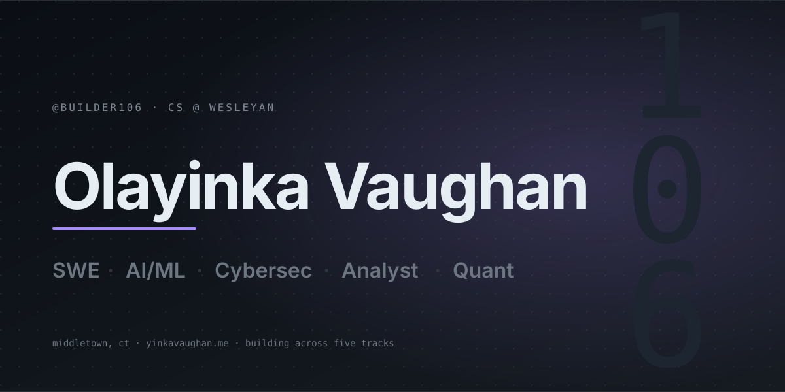
</picture>

Hi, I'm Olayinka — CS and Econ at Wesleyan. Everything I've built so far is below, arranged by language and discipline.

## The Elements

<table cellspacing="2" cellpadding="0" border="0">
  <tr>
    <td width="28"></td>
    <td width="132" align="center"><code>1</code></td>
    <td width="132" align="center"><code>2</code></td>
    <td width="132" align="center"><code>3</code></td>
    <td width="132" align="center"><code>4</code></td>
    <td width="132" align="center"><code>5</code></td>
    <td width="132" align="center"><code>6</code></td>
    <td width="132" align="center"><code>7</code></td>
    <td width="132" align="center"><code>8</code></td>
  </tr>
  <tr>
    <td width="28" align="right" valign="middle"><code>1</code></td>
    <td width="132" align="center"><a href="https://github.com/Builder106/ocaml-limit" title="ocaml_limit"><picture><source media="(prefers-color-scheme: dark)" srcset="assets/cells/01-oc-dark.svg"><source media="(prefers-color-scheme: light)" srcset="assets/cells/01-oc-light.svg">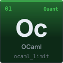</picture></a></td>
    <td width="132"></td>
    <td width="132"></td>
    <td width="132"></td>
    <td width="132"></td>
    <td width="132"></td>
    <td width="132"></td>
    <td width="132" align="center"><a href="https://github.com/Builder106/qforge" title="qforge"><picture><source media="(prefers-color-scheme: dark)" srcset="assets/cells/02-c-dark.svg"><source media="(prefers-color-scheme: light)" srcset="assets/cells/02-c-light.svg">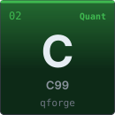</picture></a></td>
  </tr>
  <tr>
    <td width="28" align="right" valign="middle"><code>2</code></td>
    <td width="132" align="center"><a href="https://github.com/Builder106/clear-hash" title="ClearHash"><picture><source media="(prefers-color-scheme: dark)" srcset="assets/cells/03-rs-dark.svg"><source media="(prefers-color-scheme: light)" srcset="assets/cells/03-rs-light.svg">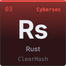</picture></a></td>
    <td width="132" align="center"><a href="https://github.com/Builder106/capitol-alpha" title="CapitolAlpha"><picture><source media="(prefers-color-scheme: dark)" srcset="assets/cells/04-py-dark.svg"><source media="(prefers-color-scheme: light)" srcset="assets/cells/04-py-light.svg">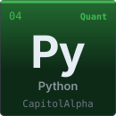</picture></a></td>
    <td width="132"></td>
    <td width="132"></td>
    <td width="132"></td>
    <td width="132"></td>
    <td width="132" align="center"><a href="https://github.com/Builder106/datafest-2026" title="datafest-2026"><picture><source media="(prefers-color-scheme: dark)" srcset="assets/cells/05-r-dark.svg"><source media="(prefers-color-scheme: light)" srcset="assets/cells/05-r-light.svg">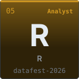</picture></a></td>
    <td width="132" align="center"><a href="https://github.com/Builder106/econ-os" title="EconOS"><picture><source media="(prefers-color-scheme: dark)" srcset="assets/cells/06-py-dark.svg"><source media="(prefers-color-scheme: light)" srcset="assets/cells/06-py-light.svg">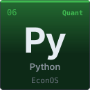</picture></a></td>
  </tr>
  <tr>
    <td width="28" align="right" valign="middle"><code>3</code></td>
    <td width="132" align="center"><a href="https://github.com/Builder106/linux-bench-hub" title="LinuxBenchHub"><picture><source media="(prefers-color-scheme: dark)" srcset="assets/cells/07-rb-dark.svg"><source media="(prefers-color-scheme: light)" srcset="assets/cells/07-rb-light.svg">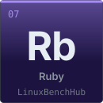</picture></a></td>
    <td width="132" align="center"><a href="https://github.com/Builder106/staija" title="STAIJA"><picture><source media="(prefers-color-scheme: dark)" srcset="assets/cells/08-ts-dark.svg"><source media="(prefers-color-scheme: light)" srcset="assets/cells/08-ts-light.svg">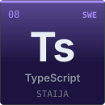</picture></a></td>
    <td width="132" align="center"><a href="https://github.com/Builder106/study-sprint" title="StudySprint"><picture><source media="(prefers-color-scheme: dark)" srcset="assets/cells/09-ts-dark.svg"><source media="(prefers-color-scheme: light)" srcset="assets/cells/09-ts-light.svg">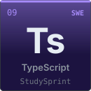</picture></a></td>
    <td width="132" align="center"><a href="https://github.com/Builder106/micro-match" title="MicroMatch"><picture><source media="(prefers-color-scheme: dark)" srcset="assets/cells/10-sv-dark.svg"><source media="(prefers-color-scheme: light)" srcset="assets/cells/10-sv-light.svg">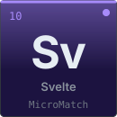</picture></a></td>
    <td width="132" align="center"><a href="https://github.com/Builder106/med-core" title="MedCore"><picture><source media="(prefers-color-scheme: dark)" srcset="assets/cells/11-ts-dark.svg"><source media="(prefers-color-scheme: light)" srcset="assets/cells/11-ts-light.svg">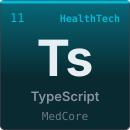</picture></a></td>
    <td width="132" align="center"><a href="https://github.com/Builder106/builder106.github.io" title="portfolio"><picture><source media="(prefers-color-scheme: dark)" srcset="assets/cells/12-ts-dark.svg"><source media="(prefers-color-scheme: light)" srcset="assets/cells/12-ts-light.svg">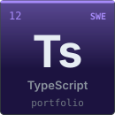</picture></a></td>
    <td width="132" align="center"><a href="https://github.com/Builder106/imc-prosperity" title="IMC_Prosperity"><picture><source media="(prefers-color-scheme: dark)" srcset="assets/cells/13-py-dark.svg"><source media="(prefers-color-scheme: light)" srcset="assets/cells/13-py-light.svg">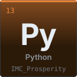</picture></a></td>
    <td width="132" align="center"><a href="https://github.com/Builder106/celestial-sanctum" title="celestial_sanctum"><picture><source media="(prefers-color-scheme: dark)" srcset="assets/cells/14-sw-dark.svg"><source media="(prefers-color-scheme: light)" srcset="assets/cells/14-sw-light.svg">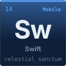</picture></a></td>
  </tr>
  <tr>
    <td width="28" align="right" valign="middle"><code>4</code></td>
    <td width="132" align="center"><a href="https://github.com/Builder106/halberd" title="halberd"><picture><source media="(prefers-color-scheme: dark)" srcset="assets/cells/15-go-dark.svg"><source media="(prefers-color-scheme: light)" srcset="assets/cells/15-go-light.svg">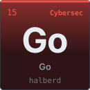</picture></a></td>
    <td width="132" align="center"><a href="https://github.com/Builder106/quarry" title="quarry"><picture><source media="(prefers-color-scheme: dark)" srcset="assets/cells/16-ts-dark.svg"><source media="(prefers-color-scheme: light)" srcset="assets/cells/16-ts-light.svg">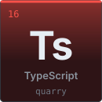</picture></a></td>
    <td width="132" align="center"><a href="https://github.com/Builder106/enclave" title="enclave"><picture><source media="(prefers-color-scheme: dark)" srcset="assets/cells/17-ts-dark.svg"><source media="(prefers-color-scheme: light)" srcset="assets/cells/17-ts-light.svg">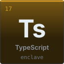</picture></a></td>
    <td width="132" align="center"><a href="https://github.com/Builder106/helm" title="helm"><picture><source media="(prefers-color-scheme: dark)" srcset="assets/cells/18-ts-dark.svg"><source media="(prefers-color-scheme: light)" srcset="assets/cells/18-ts-light.svg">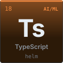</picture></a></td>
    <td width="132" align="center"><a href="https://github.com/Builder106/meta-helper" title="MetaHelper"><picture><source media="(prefers-color-scheme: dark)" srcset="assets/cells/19-kt-dark.svg"><source media="(prefers-color-scheme: light)" srcset="assets/cells/19-kt-light.svg">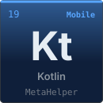</picture></a></td>
    <td width="132" align="center"><a href="https://github.com/Builder106/ascii-arcade" title="ascii_arcade"><picture><source media="(prefers-color-scheme: dark)" srcset="assets/cells/20-rs-dark.svg"><source media="(prefers-color-scheme: light)" srcset="assets/cells/20-rs-light.svg">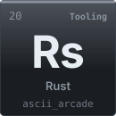</picture></a></td>
    <td width="132"></td>
    <td width="132"></td>
  </tr>
</table>

## Repos

 &nbsp; [ocaml_limit](https://github.com/Builder106/ocaml-limit) | [qforge](https://github.com/Builder106/qforge) | [EconOS](https://github.com/Builder106/econ-os)

 &nbsp; [IMC_Prosperity](https://github.com/Builder106/imc-prosperity) | [enclave](https://github.com/Builder106/enclave) | [helm](https://github.com/Builder106/helm)

 &nbsp; [ClearHash](https://github.com/Builder106/clear-hash) | [halberd](https://github.com/Builder106/halberd) | [quarry](https://github.com/Builder106/quarry)

 &nbsp; [CapitolAlpha](https://github.com/Builder106/capitol-alpha) | [datafest-2026](https://github.com/Builder106/datafest-2026) | [LinuxBenchHub](https://github.com/Builder106/linux-bench-hub)

 &nbsp; [MedCore](https://github.com/Builder106/med-core)

 &nbsp; [STAIJA](https://github.com/Builder106/staija) | [StudySprint](https://github.com/Builder106/study-sprint) | [MicroMatch](https://github.com/Builder106/micro-match) | [portfolio](https://github.com/Builder106/builder106.github.io)

 &nbsp; [MetaHelper](https://github.com/Builder106/meta-helper) | [celestial-sanctum](https://github.com/Builder106/celestial-sanctum)

 &nbsp; [ascii-arcade](https://github.com/Builder106/ascii-arcade)

## Flagships

- **[ocaml_limit](https://github.com/Builder106/ocaml-limit)** |  — Zero-allocation limit-order-book matching engine. **~18M ops/sec, p99 < 1µs**. Bloomberg-terminal-styled live dashboard. → [demo](https://ocaml-lob.vercel.app/)
- **[MedCore](https://github.com/Builder106/med-core)** |  — Centralized digital health records platform for African healthcare providers. **Winner, Yale Africa Innovation Symposium IV**. FHIR R4 & AI risk triage. → [demo](https://medcore-health.vercel.app)
- **[ClearHash](https://github.com/Builder106/clear-hash)** |  — Rebuild every package, compare every byte, block every tamper. Supply-chain integrity verifier driven by **Sigstore + SLSA**. → [demo](https://clearhash.vercel.app/)
- **[CapitolAlpha](https://github.com/Builder106/capitol-alpha)** |  — Found a **+2.58% Jensen's α** (p<0.05) across 16,203 disclosed Congressional trades, 2020–2024. → [demo](https://capitolalpha.vercel.app/)
- **[datafest-2026](https://github.com/Builder106/datafest-2026)** |  — Wesleyan DataFest 2026 (Team 13). Transportation barriers in EHR data drive **3× emergency-department visits** across 7.6M encounters, 947K patients. → [demo](https://datafest-2026.vercel.app/)
- **[LinuxBenchHub](https://github.com/Builder106/linux-bench-hub)** |  — VM benchmarking across Ubuntu, Fedora, and Debian under **identical virtual hardware**. Phoronix + Rails 8 + noVNC live view. → [demo](https://linuxbenchhub.vercel.app/)

## Stack

**Systems** &nbsp;    

**Web** &nbsp;       

**Data** &nbsp;     

**Infra** &nbsp;      
